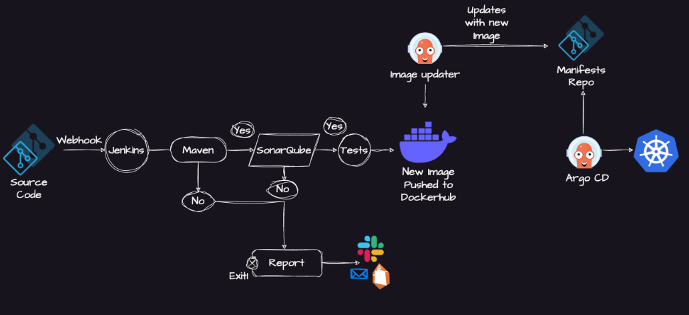
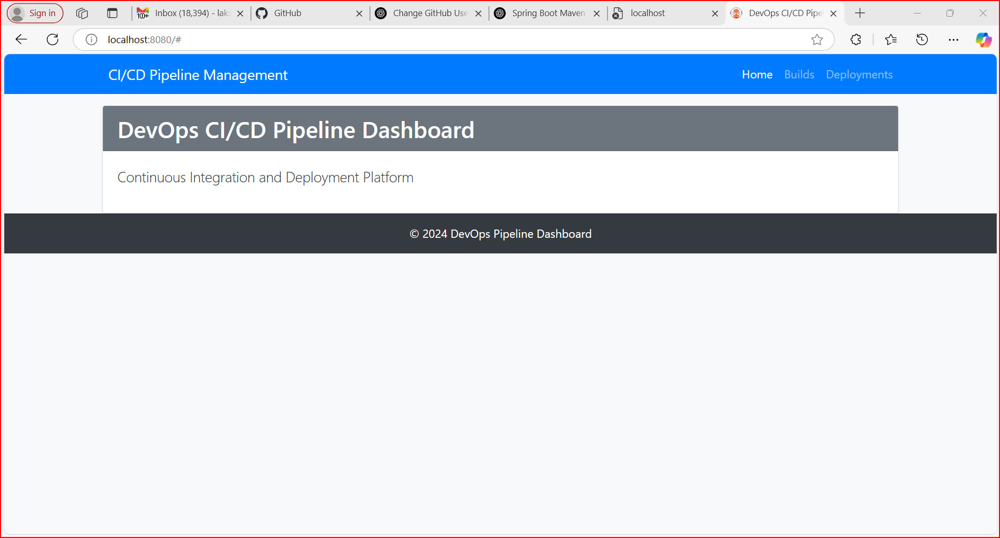
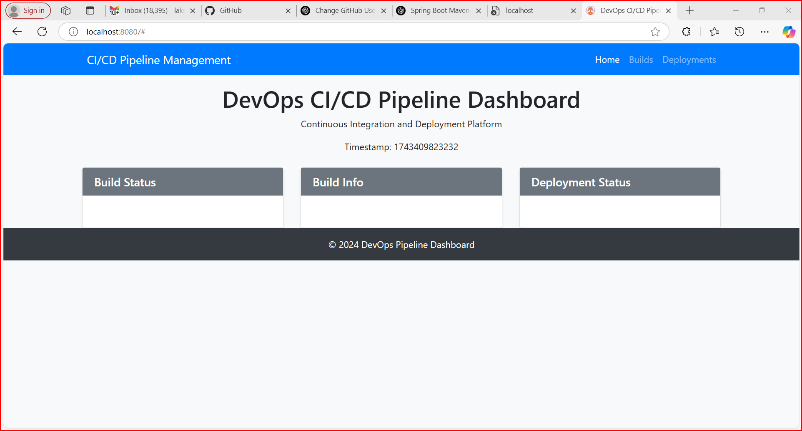
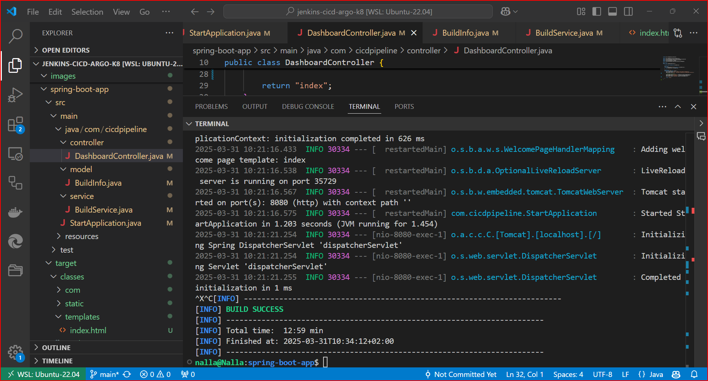
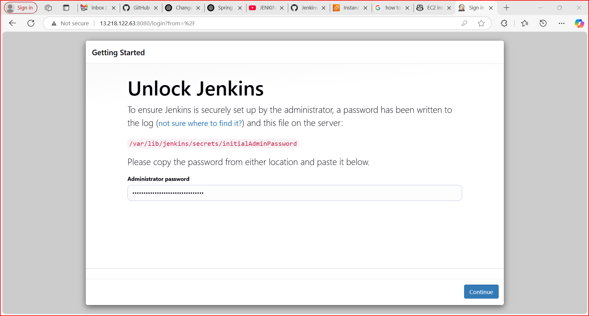
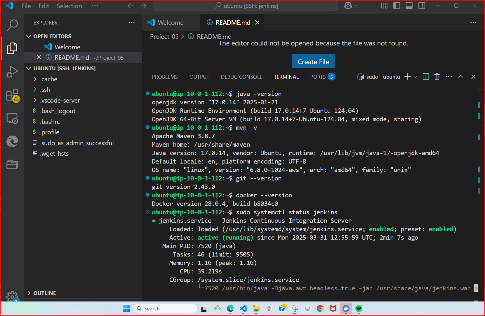

# Implementation of the Entire Advanced CI/CD Pipeline with Jenkins, ArgoCD, and Kubernetes





## Overview
This project sets up a complete CI/CD pipeline using Jenkins, ArgoCD, Kubernetes (Minikube), Docker, SonarQube, Git, and Maven. The infrastructure is provisioned using Terraform, and the necessary tools are installed automatically on AWS EC2 instances.

### Here are some of the images taken during the deployment time:







## Infrastructure Setup
### 1. Jenkins EC2 Instance
- Jenkins is installed on an EC2 instance.
- Required plugins and credentials are configured automatically.
- SonarQube, Docker, Git, and Maven are installed for build and analysis.

### 2. ArgoCD & Kubernetes EC2 Instance
- Minikube is used to set up a local Kubernetes cluster.
- ArgoCD is installed to manage Kubernetes deployments.
- Jenkins interacts with this instance for continuous deployment.

## Prerequisites
Ensure the following are installed on your local machine:
- Terraform
- AWS CLI
- SSH Key for EC2 access

## Deployment Steps

### 1. Deploy Infrastructure
```sh
terraform init
terraform apply -auto-approve
```
This provisions:
- Jenkins server
- ArgoCD & Minikube server
- Security groups, IAM roles, and networking components

### 2. Access Jenkins
Retrieve the public IP of the Jenkins instance from Terraform output:
```sh
echo $(terraform output jenkins_instance_public_ip)
```
Open Jenkins in your browser:
```
http://<JENKINS_PUBLIC_IP>:8080
```
Login with the initial password:
```sh
sudo cat /var/lib/jenkins/secrets/initialAdminPassword
```

### 3. Configure Jenkins
Run the automation script to install required plugins and configure credentials:
```sh
bash jenkins-plugins-script.sh
```

### 4. Access ArgoCD
Retrieve the public IP of the ArgoCD instance:
```sh
echo $(terraform output argocd_instance_public_ip)
```
Expose ArgoCD server:
```sh
kubectl patch svc argocd-server -n argocd -p '{"spec": {"type": "LoadBalancer"}}'
```
Login to ArgoCD:
```sh
ARGOCD_PASSWORD=$(kubectl -n argocd get secret argocd-initial-admin-secret -o jsonpath="{.data.password}" | base64 --decode)
argocd login <ARGOCD_PUBLIC_IP> --username admin --password $ARGOCD_PASSWORD
```

### 5. Set Up CI/CD Pipeline
#### Jenkins Pipeline Example
Create a `Jenkinsfile` in your repo:
```groovy
pipeline {
    agent any
    stages {
        stage('Checkout') {
            steps {
                git 'https://github.com/your-repo.git'
            }
        }
        stage('Build') {
            steps {
                sh 'mvn clean package'
            }
        }
        stage('SonarQube Analysis') {
            steps {
                sh 'mvn sonar:sonar'
            }
        }
        stage('Docker Build & Push') {
            steps {
                sh 'docker build -t your-image .'
                sh 'docker push your-image'
            }
        }
        stage('Deploy to Kubernetes') {
            steps {
                sh 'kubectl apply -f k8s-deployment.yaml'
            }
        }
    }
}
```

### 6. Monitor Deployment
Check Kubernetes pods:
```sh
kubectl get pods -n argocd
```
Check logs:
```sh
kubectl logs -f <pod-name> -n argocd
```

## Conclusion
This setup ensures seamless CI/CD integration with Jenkins, ArgoCD, Kubernetes, Docker, and SonarQube. Adjust configurations as needed to fit your project’s requirements.
